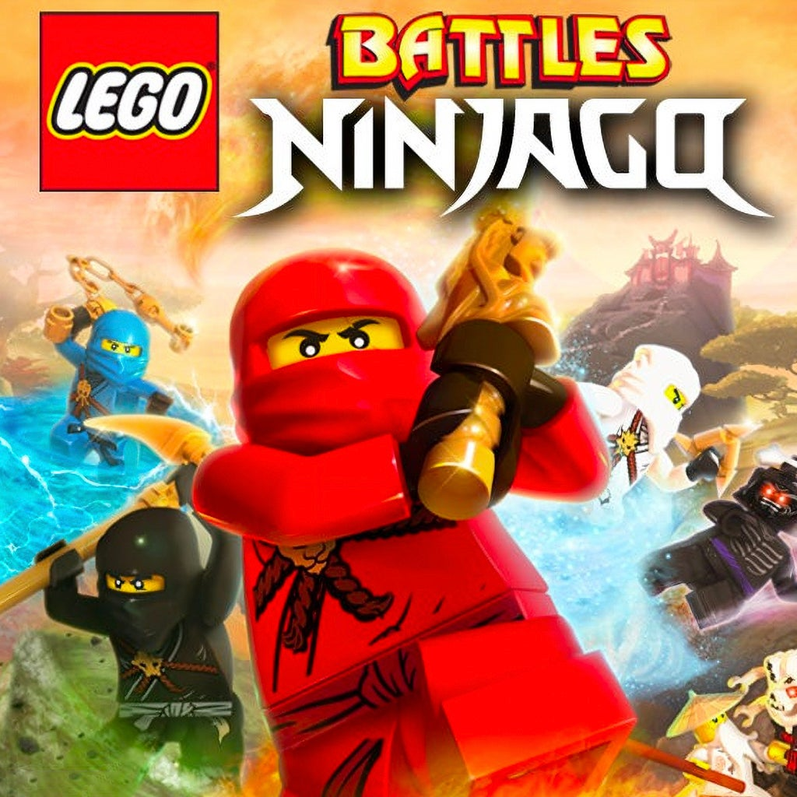

# 2011 - LEGO Battles: Ninjago

## Release Date

- NA: 12 April 2011
- EU: 15 April 2011
- AU: 20 April 2011

## Description

Lego Battles: Ninjago is a real-time strategy game where players build bases, gather resources, and command LEGO ninja and enemy forces in tactical battles. It’s themed around the world of Ninjago, letting you lead ninja heroes with unique abilities or the opposing forces through missions with strategic objectives. You construct buildings, upgrade units, and use special abilities to defeat the enemy and achieve your goals.

It keeps the core RTS gameplay of the original Lego Battles but adds Ninjago-flavored heroes and abilities and a story centered on ninja quests and battles.

## Platforms

- Nintendo DS

## Developer

- Hellbent Games

## Publisher

- Warner Bros. Interactive Entertainment
- TT Games Publishing

## Notes

*Nothing*
