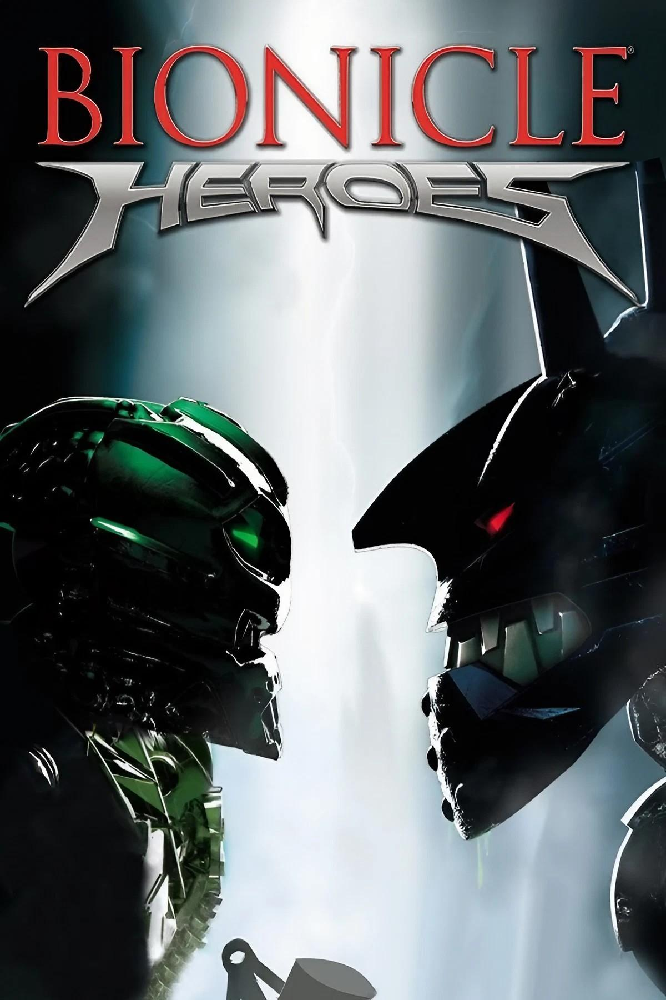

# 2006 - Bionicle Heroes

## Release Date

- NA: November 14, 2006
- EU: November 24, 2006
- EU: January 12, 2007 (DS)
- NA: April 24, 2007 (Wii)
- EU: May 25, 2007 (Wii)

## Description

Bionicle Heroes is an action shooter set in the Bionicle universe where you fight enemies and complete levels by blasting foes, solving simple puzzles, and using special abilities tied to collectible masks. You control heroes from the Bionicle world, defeat robotic enemies, collect pieces to power up, and use elemental mask powers to overcome challenges and progress through different zones.

## Platforms

- Game Boy Advance
- GameCube
- J2ME
- Nintendo DS
- PlayStation 2
- Windows
- Xbox 360
- Wii

## Developer

- Traveller's Tales
- Amaze Entertainment (handheld)
- Universomo (J2ME)

## Publisher

- Eidos Interactive
- TT Games Publishing

## Notes

*Nothing*
