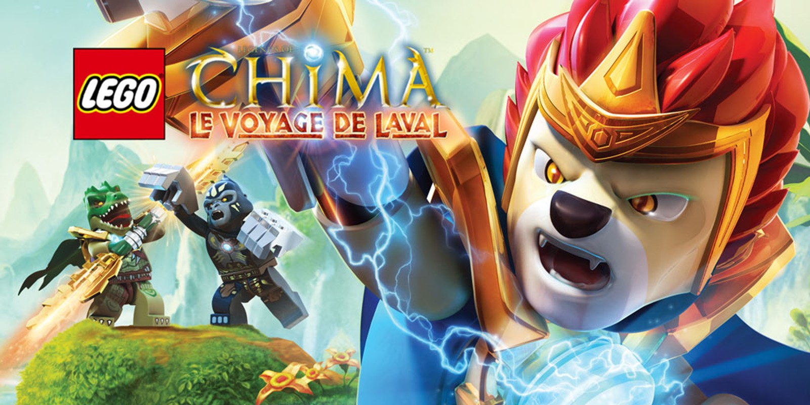

# 2013 - LEGO Legends of Chima: Laval's Journey

## Release Date

- Nintendo 3DS, PlayStation Vita
  - EU: 21 June 2013
  - NA: 25 June 2013
  - AU: 26 June 2013
- Nintendo DS
  - NA: 31 August 2013
  - EU: 6 September 2013
  - AU: 23 September 2013

## Description

Lego Legends of Chima: Laval’s Journey is an action-adventure game where you follow Laval, a warrior from the Lion Tribe, on a quest through the world of Chima to stop his rival Cragger from using powerful Chi for bad things. You explore varied areas, fight enemies, and solve simple platforming challenges while unlocking and playing as characters from different animal tribes, each with unique abilities. The game mixes exploration, combat, character ability use, and collection as you progress through multiple levels and try to restore balance to Chima.

## Platforms

- Nintendo 3DS
- Nintendo DS
- PlayStation Vita

## Developer

-	TT Fusion

## Publisher

- Warner Bros. Interactive Entertainment

## Notes

*Nothing*
