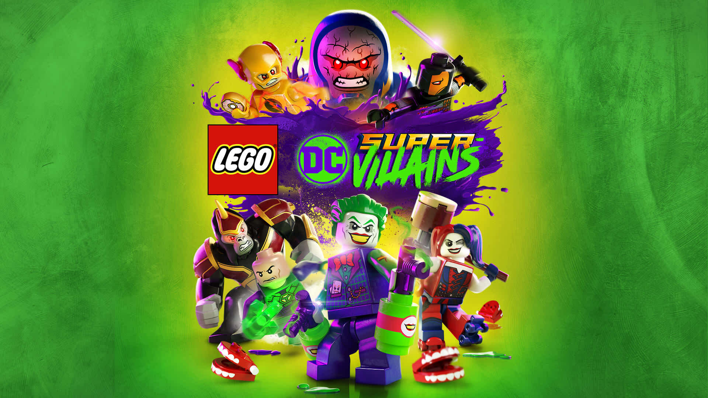

# 2018 - LEGO DC Super-Villains

## Release Date

- NA: 16 October 2018
- WW: 19 October 2018
- WW: 30 July 2019 (macOS)

## Description

LEGO DC Super-Villains is an action-adventure LEGO game where you step into the shoes of your own custom super-villain and team up with famous DC bad guys like the Joker and Harley Quinn to cause chaos and uncover a mystery involving fake heroes called the “Justice Syndicate.” You explore open-world DC locations, solve puzzles, fight heroes and enemies with unique villain abilities, and use clever tricks and powers to progress through a humorous, story-driven adventure.

## Platforms

- Nintendo Switch
- PlayStation 4
- Windows
- Xbox One
- macOS

## Developer

- Traveller's Tales

## Publisher

- Warner Bros. Interactive Entertainment

## Notes

*Nothing*
