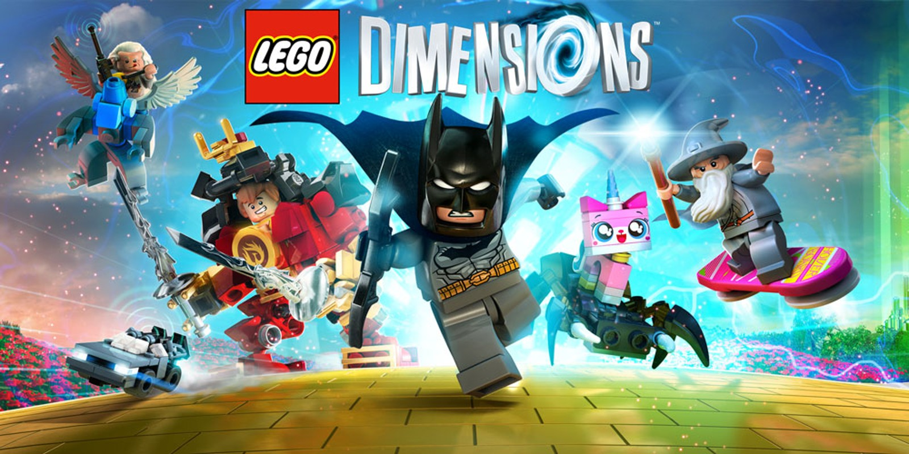

# 2015 - LEGO Dimensions

## Release Date

- NA: 27 September 2015
- AU: 28 September 2015
- EU: 29 September 2015

## Description

LEGO Dimensions is a toys-to-life action-adventure game where you mix physical LEGO minifigures, vehicles, and gadgets with digital gameplay. You place real LEGO figures on a special “toy pad” to bring them into the game and use their unique abilities to solve puzzles, fight enemies, and explore levels. The game crosses over dozens of different franchises (like DC Comics, The Lord of the Rings, The LEGO Movie, Portal, etc.), letting characters and vehicles from different worlds interact in the same game. It blends traditional LEGO action-adventure mechanics with creative cross-brand mash-ups and unlockable content through expansion packs.

## Platforms

- PlayStation 3
- PlayStation 4
- Xbox One
- Xbox 360
- Wii U

## Developer

- Traveller's Tales

## Publisher

- Warner Bros. Interactive Entertainment

## Notes

*Nothing*
